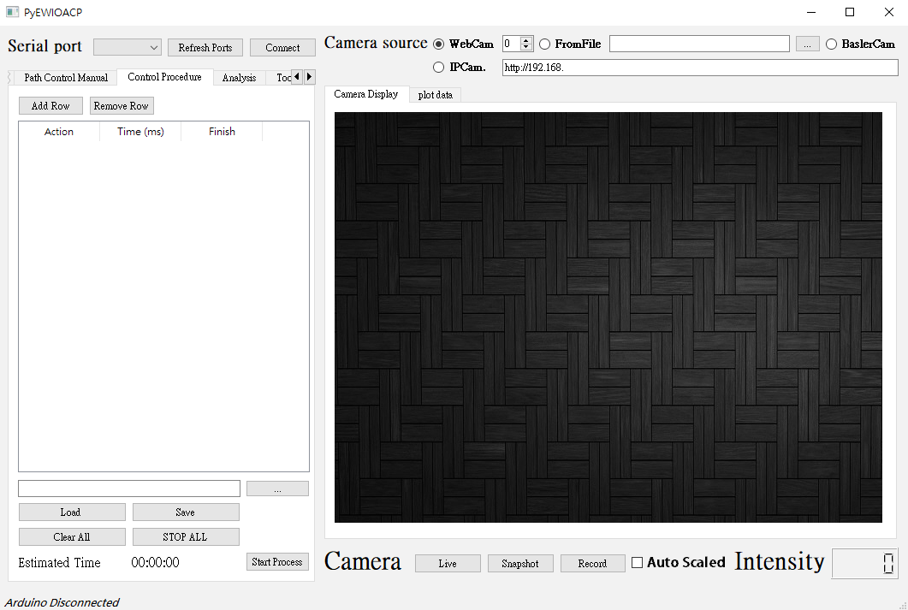
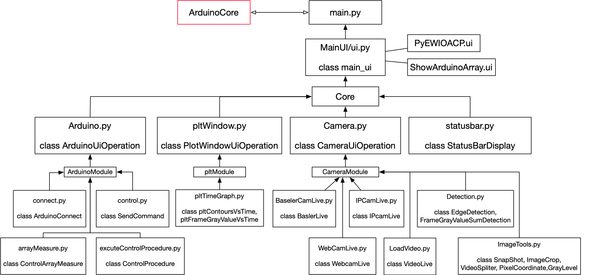

# PyEWIOACP
ElectroWetting Image Operate with Arduino Control Platform(PyEWIOACP) is my research tools developed by python programing during the Ph.D.



# Requirement
```text
PyQt5
pyserial
opencv-python
matplotlib
```
if prefer using industrial camera of Basler as video source, please follow the steps below

1. Download the [**_pylon_**](https://www.baslerweb.com/en/sales-support/downloads/software-downloads/) camera software suite from basler official website
2. Install [**_pypylon_**](https://github.com/basler/pypylon) which the python wrapper for the Basler pylon Camera Software Suite

# Architecture


# Usage
```cmd
cd PyEWIOACP

mkdir snapshot_pic

python main.py
```

# Reference

* <https://github.com/curtis992250/Arduino-Control-Interface-for-Electro-Wetting>

# Update

* 2019.9.5 Add module which plotting contours area against frame 
* 2019.9.10 Add image gray level transform function
* 2019.12.17 Add IPcamera module 
* 2020.1.9 Add automated process setup module
* 2020.1.19 Add pltdata output function & estimate frame gray value function
* 2020.1.21 Add Estimate time that procedure consuming function 